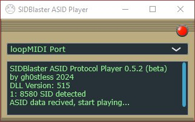

# SIDBlaster ASID Protocol Player

A small standalone app that turns real SID chip hardware into an ASID-compatible
synth: it listens for [ASID protocol](docs/asid_protocol.txt) MIDI SysEx messages
(as sent by SIDStation-compatible trackers/players) and forwards the register
writes to up to three [SIDBlaster-USB](https://github.com/gh0stless/SIDBlaster-USB-Tic-Tac-Edition)
devices via `hardsid.dll`.

## Features

- Full ASID protocol decoding (start/stop, register writes, LCD display text)
- Drives up to **three** SIDBlaster-USB devices at once (1SID/2SID/3SID setups)
- Auto-detects connected SID chip type (6581 / 8580) per device
- MIDI input device selection, remembered between runs
- Activity LED and live status/log output
- Clean failure handling: shows a dialog and exits if `hardsid.dll` can't be
  loaded or no SIDBlaster is found, instead of silently limping along

## Requirements

- A [SIDBlaster-USB](https://github.com/gh0stless/SIDBlaster-USB-Tic-Tac-Edition) device (1-3 units)
- The matching `hardsid.dll` (Windows) / `libhardsid.so` (Linux) / `libhardsid.dylib` (macOS)
  next to the executable - see [`libs/`](libs/) for a prebuilt copy
- An ASID-capable source (e.g. a tracker or DAW sending ASID SysEx over MIDI)

## Build

Built with [JUCE](https://juce.com) 9.0.0 via the Projucer. Open
`SIDBlaster ASID Player.jucer` in the Projucer, resave (regenerates the
exporter projects below), then:

##### Windows

Export for Visual Studio 2022 and build. `hardsid.dll` must be next to the
built exe (see [Requirements](#requirements)).

##### Linux

Export for Linux Makefile, then `make CONFIG=Release` in `Builds/LinuxMakefile`.
If memory is tight, use `make CONFIG=Release -j1` to avoid parallel compilation.
Expects `libhardsid.so` at `/usr/local/lib/`.

##### macOS

Export for Xcode and build. Expects `libhardsid.dylib` at `/usr/local/lib/`.

## Version

Current release: **1.1**

## hardsid.dll

https://github.com/gh0stless/SIDBlasterUSB_HardSID-emulation-driver

## License

SIDBlaster ASID Player is licensed under GPL v3:
https://www.gnu.org/licenses/gpl-3.0.en.html

Please also note the JUCE end user license: https://juce.com/juce-9-licence

The ASID SysEx decoder is adapted from the
[USBSID-Pico](https://github.com/LouDnl/USBSID-Pico) project.

## Thanks

Thanks to Wilfred Bos, Stein Pedersen & Ken Händel for their help with
`hardsid.dll`.

***- Andreas Schumm (gh0stless), crazy-midi.de***
